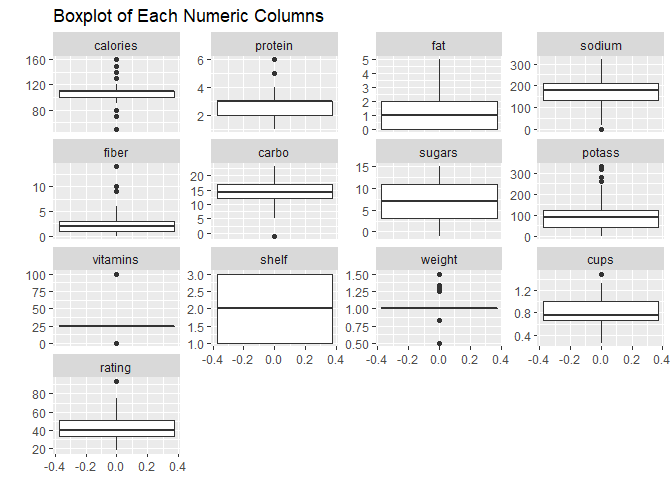
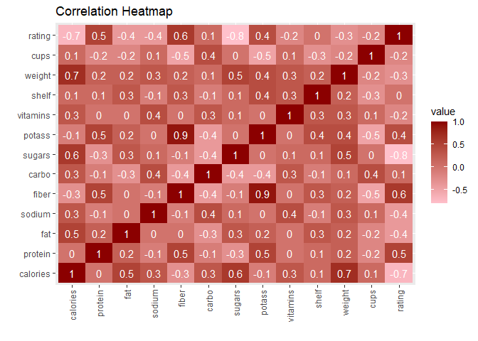
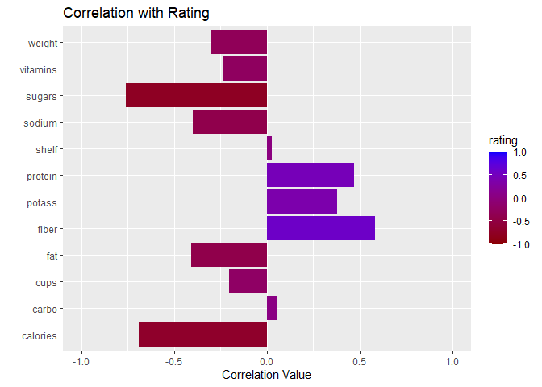
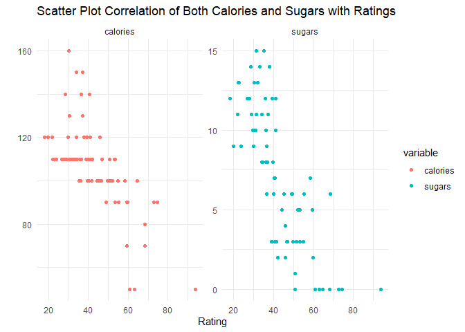
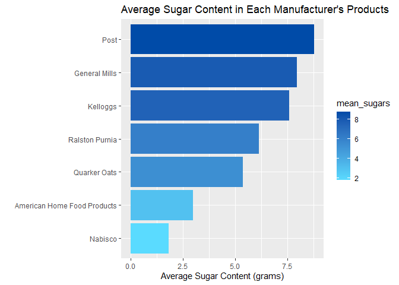
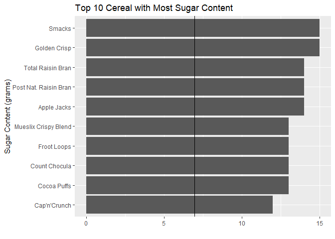

\#1. Explanation

The dataset is from Kaggle
<https://www.kaggle.com/datasets/crawford/80-cereals>. This dataset
contains information about 80 different cereal products from 7
manufacturers. Manufacturers include American Home Food Products,
General Mills, Kellogs, Nabisco, Post, Quaker Oats, and Ralston Purina.
This analysis will provide understanding of what goes in the cereal that
we eat everyday for breakfast.

\#2. Read data and initial inspection

Read data using read.csv (data is in the same folder)

    cereal <- read.csv("cereal.csv")

Data dimension is 77 rows by 16 columns

    dim(cereal)

    ## [1] 77 16

Initial data inspection

    names(cereal)

    ##  [1] "name"     "mfr"      "type"     "calories" "protein"  "fat"     
    ##  [7] "sodium"   "fiber"    "carbo"    "sugars"   "potass"   "vitamins"
    ## [13] "shelf"    "weight"   "cups"     "rating"

    head(cereal, 10)

    ##                         name mfr type calories protein fat sodium fiber carbo
    ## 1                  100% Bran   N    C       70       4   1    130  10.0   5.0
    ## 2          100% Natural Bran   Q    C      120       3   5     15   2.0   8.0
    ## 3                   All-Bran   K    C       70       4   1    260   9.0   7.0
    ## 4  All-Bran with Extra Fiber   K    C       50       4   0    140  14.0   8.0
    ## 5             Almond Delight   R    C      110       2   2    200   1.0  14.0
    ## 6    Apple Cinnamon Cheerios   G    C      110       2   2    180   1.5  10.5
    ## 7                Apple Jacks   K    C      110       2   0    125   1.0  11.0
    ## 8                    Basic 4   G    C      130       3   2    210   2.0  18.0
    ## 9                  Bran Chex   R    C       90       2   1    200   4.0  15.0
    ## 10               Bran Flakes   P    C       90       3   0    210   5.0  13.0
    ##    sugars potass vitamins shelf weight cups   rating
    ## 1       6    280       25     3   1.00 0.33 68.40297
    ## 2       8    135        0     3   1.00 1.00 33.98368
    ## 3       5    320       25     3   1.00 0.33 59.42551
    ## 4       0    330       25     3   1.00 0.50 93.70491
    ## 5       8     -1       25     3   1.00 0.75 34.38484
    ## 6      10     70       25     1   1.00 0.75 29.50954
    ## 7      14     30       25     2   1.00 1.00 33.17409
    ## 8       8    100       25     3   1.33 0.75 37.03856
    ## 9       6    125       25     1   1.00 0.67 49.12025
    ## 10      5    190       25     3   1.00 0.67 53.31381

Data structure

    str(cereal)

    ## 'data.frame':    77 obs. of  16 variables:
    ##  $ name    : chr  "100% Bran" "100% Natural Bran" "All-Bran" "All-Bran with Extra Fiber" ...
    ##  $ mfr     : chr  "N" "Q" "K" "K" ...
    ##  $ type    : chr  "C" "C" "C" "C" ...
    ##  $ calories: int  70 120 70 50 110 110 110 130 90 90 ...
    ##  $ protein : int  4 3 4 4 2 2 2 3 2 3 ...
    ##  $ fat     : int  1 5 1 0 2 2 0 2 1 0 ...
    ##  $ sodium  : int  130 15 260 140 200 180 125 210 200 210 ...
    ##  $ fiber   : num  10 2 9 14 1 1.5 1 2 4 5 ...
    ##  $ carbo   : num  5 8 7 8 14 10.5 11 18 15 13 ...
    ##  $ sugars  : int  6 8 5 0 8 10 14 8 6 5 ...
    ##  $ potass  : int  280 135 320 330 -1 70 30 100 125 190 ...
    ##  $ vitamins: int  25 0 25 25 25 25 25 25 25 25 ...
    ##  $ shelf   : int  3 3 3 3 3 1 2 3 1 3 ...
    ##  $ weight  : num  1 1 1 1 1 1 1 1.33 1 1 ...
    ##  $ cups    : num  0.33 1 0.33 0.5 0.75 0.75 1 0.75 0.67 0.67 ...
    ##  $ rating  : num  68.4 34 59.4 93.7 34.4 ...

Data summary

    summary(cereal)

    ##      name               mfr                type              calories    
    ##  Length:77          Length:77          Length:77          Min.   : 50.0  
    ##  Class :character   Class :character   Class :character   1st Qu.:100.0  
    ##  Mode  :character   Mode  :character   Mode  :character   Median :110.0  
    ##                                                           Mean   :106.9  
    ##                                                           3rd Qu.:110.0  
    ##                                                           Max.   :160.0  
    ##     protein           fat            sodium          fiber       
    ##  Min.   :1.000   Min.   :0.000   Min.   :  0.0   Min.   : 0.000  
    ##  1st Qu.:2.000   1st Qu.:0.000   1st Qu.:130.0   1st Qu.: 1.000  
    ##  Median :3.000   Median :1.000   Median :180.0   Median : 2.000  
    ##  Mean   :2.545   Mean   :1.013   Mean   :159.7   Mean   : 2.152  
    ##  3rd Qu.:3.000   3rd Qu.:2.000   3rd Qu.:210.0   3rd Qu.: 3.000  
    ##  Max.   :6.000   Max.   :5.000   Max.   :320.0   Max.   :14.000  
    ##      carbo          sugars           potass          vitamins     
    ##  Min.   :-1.0   Min.   :-1.000   Min.   : -1.00   Min.   :  0.00  
    ##  1st Qu.:12.0   1st Qu.: 3.000   1st Qu.: 40.00   1st Qu.: 25.00  
    ##  Median :14.0   Median : 7.000   Median : 90.00   Median : 25.00  
    ##  Mean   :14.6   Mean   : 6.922   Mean   : 96.08   Mean   : 28.25  
    ##  3rd Qu.:17.0   3rd Qu.:11.000   3rd Qu.:120.00   3rd Qu.: 25.00  
    ##  Max.   :23.0   Max.   :15.000   Max.   :330.00   Max.   :100.00  
    ##      shelf           weight          cups           rating     
    ##  Min.   :1.000   Min.   :0.50   Min.   :0.250   Min.   :18.04  
    ##  1st Qu.:1.000   1st Qu.:1.00   1st Qu.:0.670   1st Qu.:33.17  
    ##  Median :2.000   Median :1.00   Median :0.750   Median :40.40  
    ##  Mean   :2.208   Mean   :1.03   Mean   :0.821   Mean   :42.67  
    ##  3rd Qu.:3.000   3rd Qu.:1.00   3rd Qu.:1.000   3rd Qu.:50.83  
    ##  Max.   :3.000   Max.   :1.50   Max.   :1.500   Max.   :93.70

\#3. Data cleansing and transformation

Check if data has missing value

    anyNA(cereal)

    ## [1] FALSE

No missing value from data

Transform data type

    cereal<-cereal %>%
      mutate(mfr = as.factor(mfr),
             type = as.factor(type),
             mfr=recode(mfr, 
                        A="American Home Food Products",
                        G="General Mills",
                        K="Kelloggs",
                        N="Nabisco",
                        P="Post",
                        Q="Quarker Oats",
                        R="Ralston Purnia"),
             type=recode(type,
                         C="Cold",
                         H="Hot"))

    levels(cereal$mfr)

    ## [1] "American Home Food Products" "General Mills"              
    ## [3] "Kelloggs"                    "Nabisco"                    
    ## [5] "Post"                        "Quarker Oats"               
    ## [7] "Ralston Purnia"

    levels(cereal$type)

    ## [1] "Cold" "Hot"

Manufacturer(mfr) of cereal: - A = American Home Food Products;

-   G = General Mills

-   K = Kelloggs

-   N = Nabisco

-   P = Post

-   Q = Quaker Oats

-   R = Ralston Purina

Type of cereal: - C = Cold

-   H = Hot

Replace negative value with zero because none of the columns can have
value below zero

    cereal[cereal < 0] <- 0

\#4. Further exploratory analysis

Correlation heatmap of numeric columns value

    cereal_is.numeric <- cereal %>% 
      select_if(is.numeric)

    cereal_heatmap <- round(cor(cereal_is.numeric), 1)
    cereal_heatmap <- melt(cereal_heatmap)

    ggplot(cereal_heatmap, aes(x=X1, y=X2, fill=value)) +
      geom_tile()+
      scale_fill_gradient(low = "pink", high = "dark red")+
      labs(title="Correlation Heatmap",x="", y="")+
      geom_text(aes(x=X1, y=X2, label=value), color="white")+
      theme(axis.text.x = element_text(angle = 90, vjust = 0.5, hjust=1))

Maybe it is more crucial to look at the correlation specific to the
rating column

    cereal_ratcorr <- data.frame(cor(cereal_is.numeric)) %>% select(rating) %>% filter(rating != 1)
    cereal_ratcorr$id <- row.names(cereal_ratcorr)

    ggplot(cereal_ratcorr, mapping=aes(x=id, y=rating, fill=rating)) +
      geom_col()+
      ylim(-1,1)+
      scale_fill_gradient(low = "dark red",  high = "blue", limits=c(-1,1))+
      labs(title="Correlation with Rating",x="", y="Correlation Value")+
      coord_flip()

Calories and Sugar have a pretty negative correlation with ratings

    cereal_calcor<- melt(cereal %>% 
    select(rating, calories, sugars), id.vars="rating")
      
      
    ggplot(cereal_calcor, mapping=aes(x=rating, y=value)) +
      facet_wrap(vars(variable), scale="free_y")+
      geom_point(aes(col=variable))+
      labs(title="Scatter Plot Correlation of Both Calories and Sugars with Ratings",x="Rating", y="")+
      theme_minimal()

Manfacturer ranked by average sugars in their products

    mfr_sugar <- cereal %>% 
      group_by(mfr) %>% 
      summarise(mean_sugars = mean(sugars)) %>% 
      ungroup() %>% 
      arrange(desc(mean_sugars))

    ggplot(mfr_sugar, mapping=aes(x=reorder(mfr, mean_sugars), y=mean_sugars, fill=mean_sugars)) +
      geom_col()+
      scale_fill_gradient(low = "#5ADBFF", high = "#004BA8")+
      labs(
        title="Average Sugar Content in Each Manufacturer's Products",
        x="",
        y="Average Sugar Content (grams)"
      )+
      coord_flip()

Top 10 cereal with highest sugar level

    sugar_highest <- head(cereal %>% 
      arrange(desc(sugars)) %>% 
      select(c(name, sugars)), 10)

    ggplot(sugar_highest, mapping=aes(x=reorder(name, sugars), y=sugars))+
      geom_col()+
      geom_hline(yintercept = mean(cereal$sugars))+
      labs(
        title="Top 10 Cereal with Most Sugar Content",
        x="Sugar Content (grams)",
        y=""
        )+  
      coord_flip()

These cereal products have sugar content far above the average cereal
which is about 3-10 grams or 60-200% higher. This is a very surprising
fact and I think we should avoid eating these cereals. However, there
are cereals without sugar content which are:

    w.o_sugar <- cereal %>% 
      select(c(name, sugars)) %>% 
      filter(sugars == 0)

\#5. Conclusion
